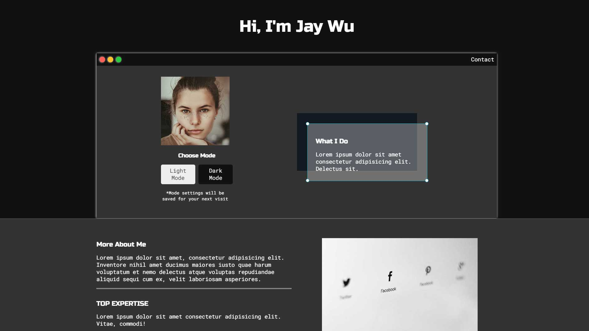
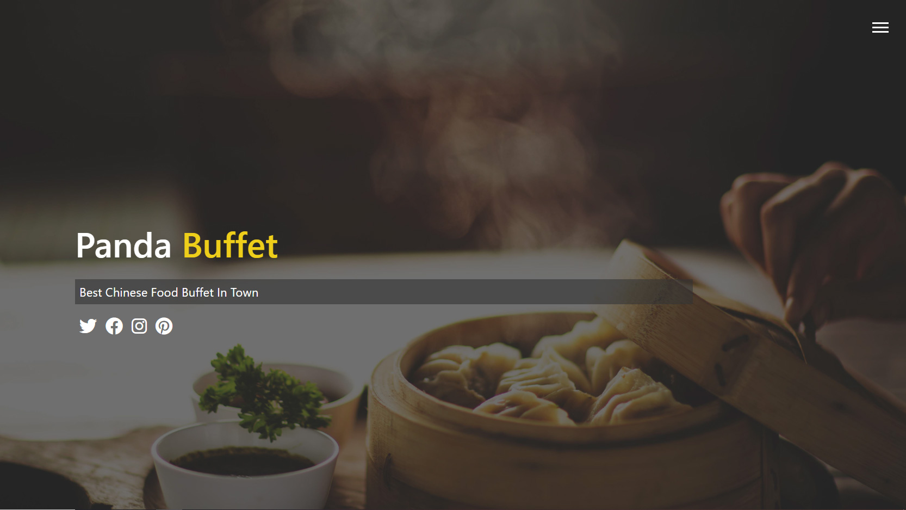
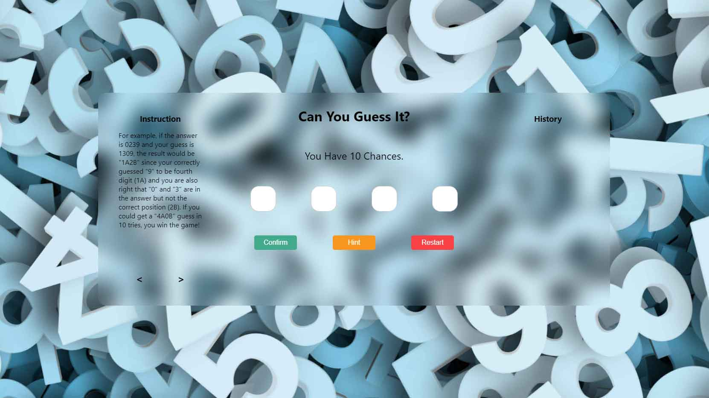

# Jie Wu's Portfolio Website

This is my [portfolio website](https://fairjay8788.github.io/portfolio/). I put most of my web projects here.

> I'm constantly updating the content as I learn more. Hope it will become something I'm proud of.

---

## Commit Log

- ### Commit 6 _2020.07.23_

1. Reorganize the docs directory, so each project has its own folder to show codes

- ### Commit 5 _2020.07.23_

1. Upload **Portfolio Mockup 1** project

- ### Commit 4 _2020.07.16_

1. Upload **Chinese Restaurant** project

- ### Commit 3 _2020.07.03_

1. Upload **Number Guessing Game** project

2. Fill content in **About** section
3. Seperate **Works** section into different categories
4. Combine commit log with README

- ### Commit 2 _2020.06.24_

1. Add **About** section
2. Add **Works** section
3. Add **Footer** section
4. Minor change on the style

- ### Commit 1 _2020.06.18_

1. Set up environment with **node-sass**
2. Create **Navbar** and **Header**
