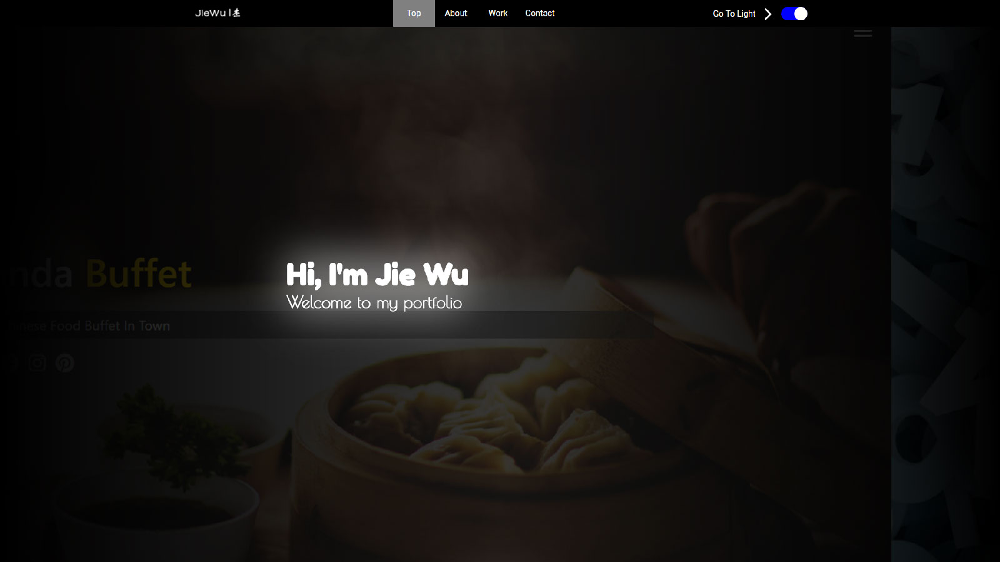
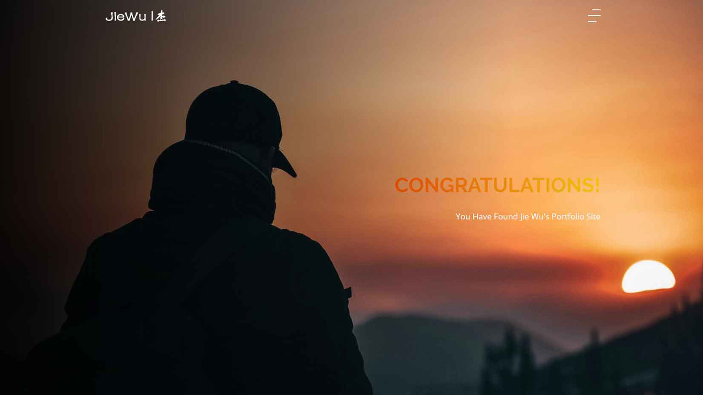

# Jie Wu's Portfolio Website

This is my [portfolio website](https://fairjay8788.github.io). I put most of my web projects here.

> I'm constantly updating the content. Hope it will become something I'm proud of.

---

## Major Commits Log

- ### 2020.8.13

1. Major Update! An entire new look of the portfolio.

2. New feature: Light/Dark theme switch. By clicking the toggler in the nav bar, the page switch between a Light appearance and a Dark one. Theme setting will be saved for next visit.

3. Smooth scroll fulfilled by **cferdinandi's** [smooth-scroll](https://github.com/cferdinandi/smooth-scroll).

4. Highlight background behind the nav menu moves to correct position as page scrolling.

5. A slide show of my works in the showcase section.

6. Hide minor projects in a drop down.

7. Last but not least, send me a message with the new [contact form](https://fairjay8788.github.io/index.html#contact)!

- ### 2020.07.23

1. Upload [Portfolio Mockup I](https://fairjay8788.github.io/portfolioMU1/)

- ### 2020.07.16

1. Upload [Panda Buffet](https://fairjay8788.github.io/restaurant/)

- ### 2020.07.03

1. Upload [Number Guessing Game](https://fairjay8788.github.io/guessnumber/)

- ### 2020.06.24

1. [Portfolio Version I](https://fairjay8788.github.io/portfolioV1/) launched.

