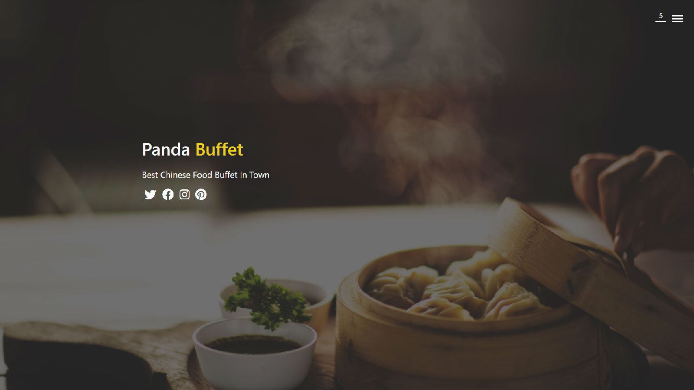

# Panda Buffet

Website for local restaurant.

When I first saw the background image of the landing page, I felt so hungry. Yes, that's almost the entire reason why I built this. If I see a real website like this for a real restaurant, I will go grab a bite. I like the design of the website navigation menu, which feels like a door. It's a good choice for a chinese restaurant website. [Check it out](https://fairjay8788.github.io/restaurant/).

- ### 2020.08.25

1. Redesign the website. Now it's with multiple pages and completely responsive.

2. New feature: shopping cart. User can now order food in the Menu page. The order list will be saved in local storage. The number in the upper-right corner shows how many dishes are currently in order.

3. A new order summary page which shows order details and also has options to clear order and checkout.

- ### 2020.07.16

1. Project launched.
